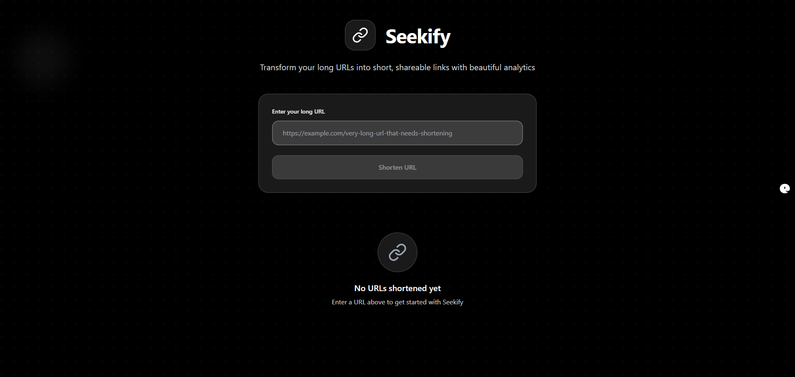

# Seekify
A beautiful, minimal URL shortener built with React, TypeScript, and Tailwind CSS. Instantly shorten URLs and track click analytics with a clean UI.

## Preview



## ✨ Features

- 🔗 Shorten long URLs instantly
- 📊 View total click analytics
- 💾 Track recent URLs via local storage
- ⚡ Built with modern tech (React + Vite + Tailwind CSS)
- 🌚 Dark theme UI

## 🚀 Tech Stack

- **Frontend**: React + TypeScript
- **UI**: Tailwind CSS, Lucide Icons
- **Build Tool**: Vite
- **Analytics Storage**: Browser `localStorage`

## 📦 Getting Started

Clone the repository and install dependencies:

```bash
git clone https://github.com/sudheerprasannakumarvasetty
/seekify.git
cd seekify
npm install
````

Start the development server:

```bash
npm run dev
```

Open your browser at [http://localhost:5173](http://localhost:5173)

## 🛠️ Project Structure

```
seekify/
├── src/
│   ├── App.tsx            # Main component with logic
│   ├── index.tsx          # Entry point
│   └── components/        # (Optional) for modularizing UI
├── public/
├── tailwind.config.js     # Tailwind configuration
├── package.json
├── tsconfig.json
└── vite.config.ts
```

### 🧠 Inspiration

Inspired by tools like Bitly and TinyURL, Seekify aims to offer a minimal yet powerful experience for personal link tracking and sharing.

## Contact

- **Developer:** Vasetty Sudheer Prasanna Kumar  
- **Email:** [sudheerprasannakumarv@gmail.com](mailto:sudheerprasannakumarv@gmail.com)  
- **LinkedIn:** [Sudheer's Profile](http://linkedin.com/in/sudheerprasannakumarvasetty)
